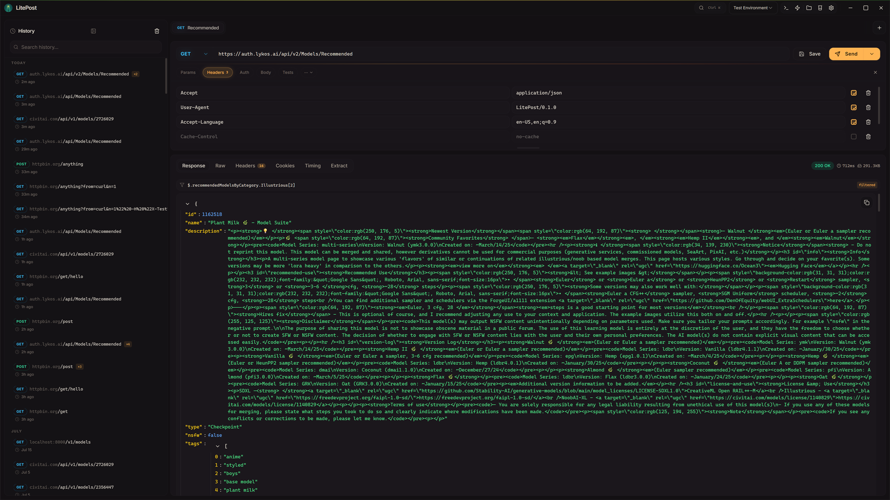
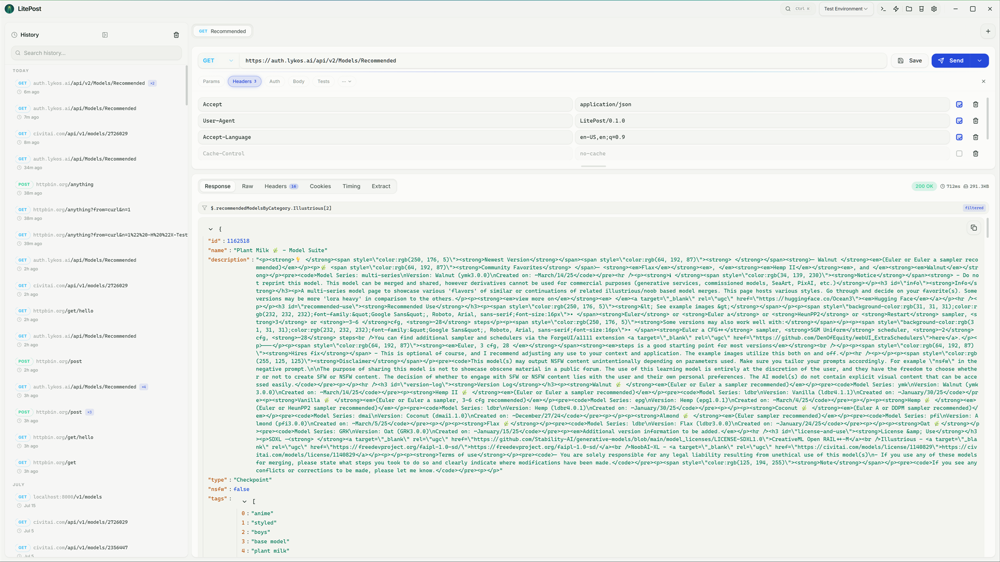
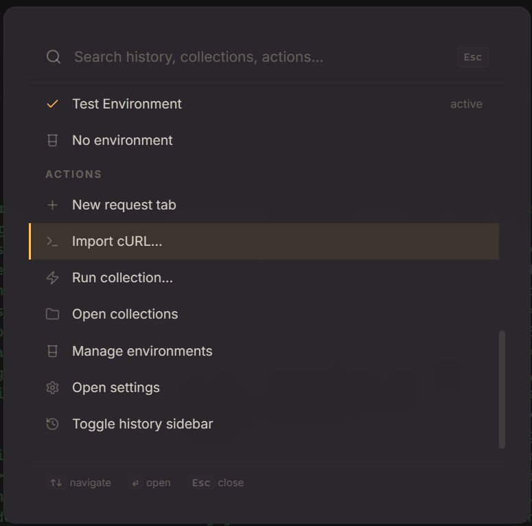

<div align="center">


# LitePost

**A fast, lightweight API client — no accounts, no cloud, no junk.**

Built with Tauri, Rust, and React. Your requests, collections, and history live in
plain JSON files on your machine and nowhere else.

[**Download**](https://github.com/LykosAI/LitePost/releases/latest) ·
[**Documentation**](https://lykos.ai/LitePost/) ·
[**Report an issue**](https://github.com/LykosAI/LitePost/issues)

</div>



<table>
<tr>
<td width="62%"></td>
<td></td>
</tr>
<tr>
<td align="center"><sub>Schematic — the light theme</sub></td>
<td align="center"><sub>Ctrl+K — search everything, do anything</sub></td>
</tr>
</table>

## Download

Grab the installer for your platform from the
[**latest release**](https://github.com/LykosAI/LitePost/releases/latest):

- **Windows** — `*_x64-setup.exe`
- **macOS** *(beta)* — `*_aarch64.app.tar.gz` (Apple Silicon) or `*_x64.app.tar.gz` (Intel)
- **Linux** *(beta)* — `*_amd64.AppImage`

No sign-up, no telemetry. LitePost updates itself in-app when new releases ship.

> **macOS note:** builds are not yet notarized — right-click the app and choose **Open** the first time.

## Features

- **Command palette** — `Ctrl+K` fuzzy-searches history and collections, switches environments, and runs any action
- **Full HTTP toolkit** — all standard methods, headers/params/cookies editors, multipart file uploads, per-request network settings (timeout, SSL, proxy)
- **Auth that does the work** — Basic, Bearer, API Key, and OAuth 2.0 with PKCE, token refresh, and one-click endpoint auto-fill from OIDC discovery
- **Live responses** — collapsible JSON tree with a `$.path[*]`-style filter bar, HTML and image previews, timing waterfall, redirect chains
- **Streaming** — first-class SSE with per-chunk timestamps and cancellation, plus a WebSocket panel
- **Environments & variables** — `{{variable}}` substitution everywhere, with inline badges showing resolved values, and response extraction rules to capture values automatically
- **Collections** — save, organize, and batch-run requests; import from cURL, OpenAPI, or Postman format
- **Testing** — JavaScript test scripts, no-code assertions, and pre-request scripts
- **Code generation** — copy any request as cURL, Python, JavaScript, C#, Go, or Ruby
- **Six themes** — from the warm default **Night Desk** to the paper-and-cobalt **Schematic** light theme

Full guides for everything live in the [documentation](https://lykos.ai/LitePost/).

## Development

Prerequisites: [Node.js](https://nodejs.org/) 20+, [pnpm](https://pnpm.io/) 9,
[Rust](https://www.rust-lang.org/) stable, and the
[Tauri platform dependencies](https://v2.tauri.app/start/prerequisites/) for your OS.

```bash
git clone https://github.com/LykosAI/LitePost.git
cd LitePost
pnpm install
pnpm tauri dev
```

Production builds land in `src-tauri/target/release/bundle/`:

```bash
pnpm tauri build
```

### Tests

```bash
pnpm test:run        # frontend (Vitest + React Testing Library)
pnpm test:coverage   # with coverage report
cargo test           # Rust backend (run inside src-tauri/)
```

### Docs site

The documentation is a [VitePress](https://vitepress.dev/) site in `docs/`,
deployed automatically to [lykos.ai/LitePost](https://lykos.ai/LitePost/) on merge:

```bash
pnpm docs:dev
```

## Contributing

Issues and pull requests are welcome. Branch from `main`, keep commits focused,
and make sure `pnpm test:run` and `cargo check` pass — CI enforces both. See the
[contributing guide](https://lykos.ai/LitePost/contributing) for details.

## License

[AGPL-3.0](LICENSE) — free to use, modify, and distribute; derivatives must remain
open source, including when served over a network.
